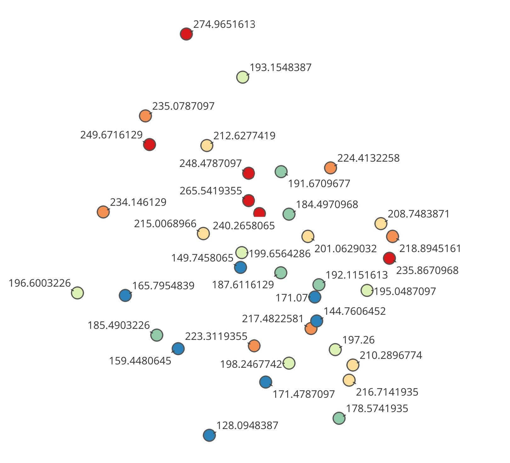
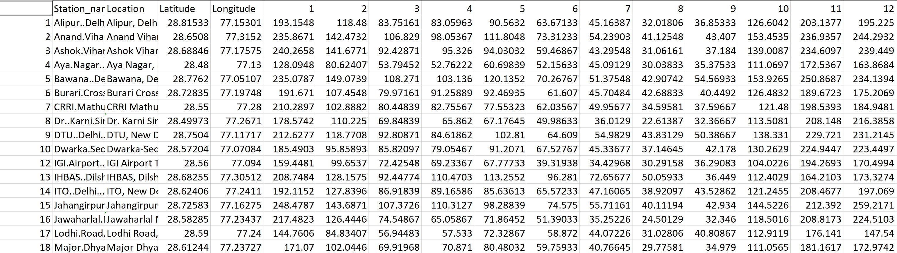
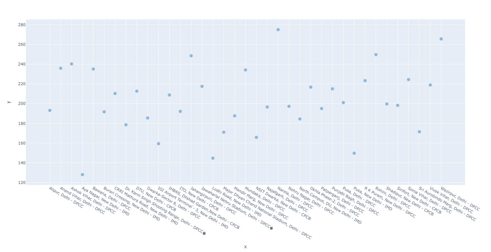

# GEOTA PROJECT README

## Introduction
The GEOTA project report presents a comprehensive geospatial analysis of air quality in Delhi, addressing the critical issue of air pollution in one of India's most populous and polluted cities. The primary objective was to create an interpolated air quality map for the year 2021, offering insights into pollution patterns and trends within the region.

## Project Overview
### Data Collection and Processing
- **Data Source:** Air quality data from CPCB (Central Pollution Control Board) for January to December 2021.
- **Data Description:** The collected data comprised PM2.5 values from various monitoring stations across Delhi.
- **Vector Operations:** Utilized QGIS software for vector operations, creating shape files that encapsulated region boundaries, industrial locations, and forests. Digitization of industries and forests facilitated detailed analysis.
- **Raster Operations:** Employed raster operations within QGIS for processing and visualization of spatial data.

### IDW Interpolation
- **Method:** Implemented Inverse Distance Weighting (IDW) interpolation method to generate a continuous surface representing air quality across Delhi.
- **IDW Explanation:** IDW is a spatial interpolation method that estimates values for unknown locations by averaging the values of surrounding known locations, weighted by their distances to the unknown location.
- **Parameters:** Utilized a cell size of 1 km and a power value of 2 for the IDW method.

### Results and Analysis
- **Air Quality Mapping:** Revealed higher PM2.5 levels in industrial and densely populated areas, contrasting with lower levels in forested and natural zones.
- **Buffer Zone Analysis:** Affirmed that areas within 1 km of industries exhibited the highest PM2.5 levels, confirming industries as significant contributors to air pollution.
- **Validation:** Comparative analysis with previous studies corroborated findings, validating the accuracy of the interpolated map for Delhi's 2021 air quality.
<!-- 
## Illustrative Images
- 
-  -->